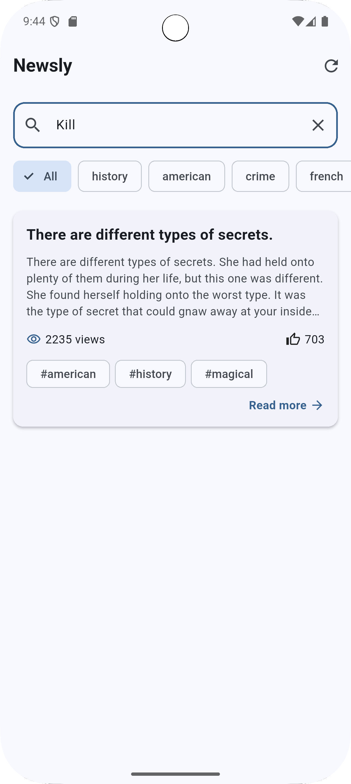
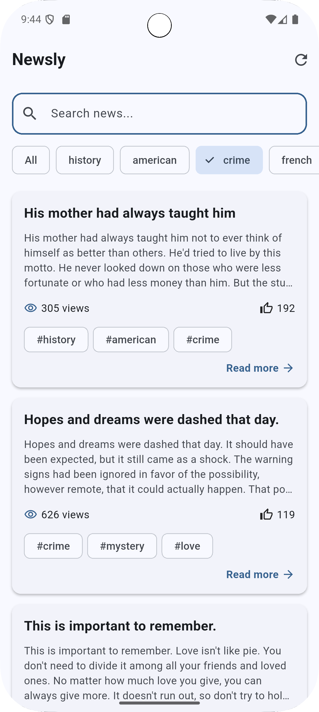
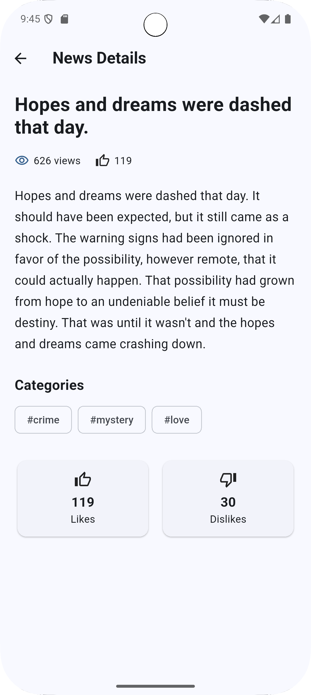
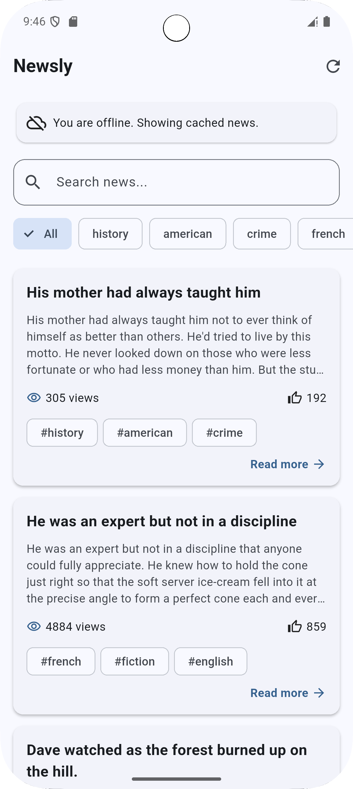

# Newsly - Flutter News App

Newsly is a cross-platform Flutter application that fetches content from a remote REST API and displays it through a clean and responsive user interface.

The project demonstrates API integration, asynchronous data handling, Cubit state management, local caching, offline support, search, category filtering, and news details.

## Features

* Fetch news from a remote REST API
* JSON data parsing
* Dio HTTP client
* BLoC/Cubit state management
* Loading and error states
* Retry functionality
* Search news by title, content, or tags
* Filter news by categories
* Pull-to-refresh
* News details screen
* Local caching using SharedPreferences
* Offline content support
* Responsive Flutter UI
* Light and dark mode support

## Technologies

* Flutter
* Dart
* Dio
* BLoC / Cubit
* SharedPreferences
* DummyJSON REST API

## Architecture

The project follows a layered architecture:

```text
Presentation
    ↓
NewsCubit
    ↓
NewsRepository
    ↓
ApiService
    ↓
REST API
```

For offline support:

```text
REST API
    ↓
JSON Response
    ↓
Local Cache
    ↓
SharedPreferences
    ↓
Cached Content
```

## Project Structure

```text
lib/
├── core/
│   └── network/
│       └── api_service.dart
│
├── cubit/
│   └── news_cubit.dart
│
├── data/
│   ├── models/
│   │   └── news_model.dart
│   └── repositories/
│       └── news_repository.dart
│
└── screens/
    ├── home_screen.dart
    └── news_details_screen.dart
```

## API

The application uses the DummyJSON REST API to retrieve news-style content.

Endpoint:

```text
https://dummyjson.com/posts
```

The application processes the returned JSON and converts it into Dart models before displaying the data.

## Offline Support

The latest successfully retrieved content is cached locally using SharedPreferences.

If the device loses internet connectivity, the application attempts to display the cached content and shows an offline indicator.

## Screenshots

### Home Screen


### Search



### Categories



### News Details



### Offline Mode



## Getting Started

### Prerequisites

* Flutter SDK
* Dart SDK
* Android Studio or VS Code
* Android emulator or physical device

### Installation

Clone the repository:

```bash
git clone https://github.com/nouranagiy/newsly-flutter.git
```

Navigate to the project:

```bash
cd newsly-flutter
```

Install dependencies:

```bash
flutter pub get
```

Run the application:

```bash
flutter run
```

## Testing

The application was tested for:

* API data fetching
* JSON parsing
* Loading state
* Error handling
* Retry functionality
* Search
* Category filtering
* Pull-to-refresh
* News details
* Local caching
* Offline mode
* Responsive UI

## Internship Task

This project was developed as part of the **App Development Internship**.

**Task:** Task 3 - Cloud-Synced Content Platform with State Management

## Author

**Nora Nagiy**

Flutter Developer
